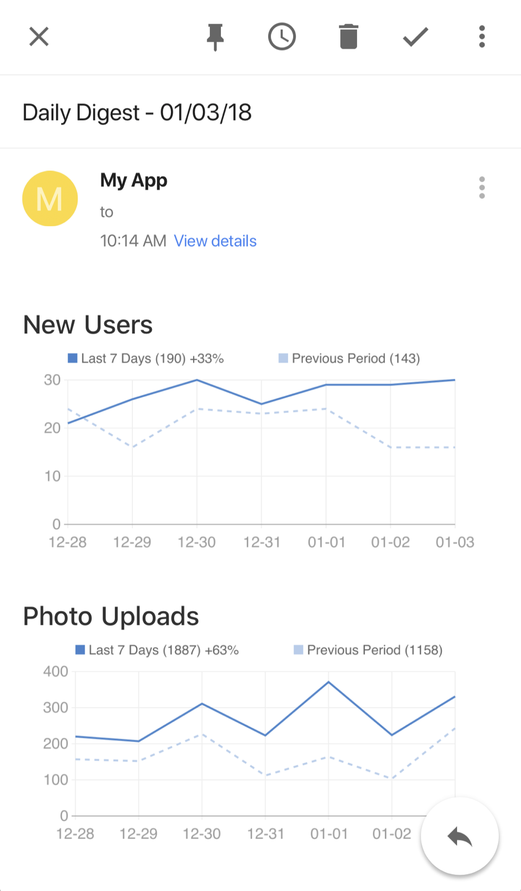

# Django Daily Digest

[](https://travis-ci.org/nickromano/django-daily-digest)
[](https://coveralls.io/github/nickromano/django-daily-digest?branch=master)
[](https://pypi.python.org/pypi/daily-digest)


Simple daily summary email with charts. Built using the awesome charting library [leather](https://github.com/wireservice/leather) and [CairoSVG](http://cairosvg.org/) to convert the SVGs to PNGs for emails.



## Configuration

Add the following configuration to your `settings.py` file.
```py
DAILY_DIGEST_CONFIG = {
    'title': 'Daily Digest',
    'from_email': 'support@test.com',
    'timezone': 'America/Los_Angeles',  # timezone for chart data (default UTC)
    'exclude_today': False,  # include the current day the email is sent in the chart (default False)
    'charts': [
        {
            'title': 'New Users',
            'app_label': 'auth',
            'model': 'user',  # app_label and model can be found in the django_content_type table
            'date_field': 'date_joined',  # used to count per day
            'filter_kwargs': {
                'is_active': True
            }
        },
        {
            'title': 'Photo Uploads',
            'app_label': 'photos',
            'model': 'photoupload',
            'date_field': 'created'
        },
    ]
}
```

## Usage

Set a scheduled job to run this once a day.  The email will be sent to all addresses in `settings.ADMINS`.
```
python manage.py send_daily_digest
```

### Preview the email before it is sent. (Optional)

Add the following to your projects `urls.py`

```py
from django.conf.urls import include

urlpatterns = [
    url(r'^', include('daily_digest.urls')),
]
```

Visit /admin/daily-digest-preview/ to see a preview. This page requires the user has admin privileges.

## Contributing

### Local setup

1. Create the virtual environment

```
mkvirtualenv --python=python3 daily-digest
```

2. Install dependencies

```
pip install -r requirements.txt
```

## FAQ

Why isn't python2.7 supported?

> The dependency `CairoSVG` doesn't support anything below python3.4.

Why is the leather project included?

> Upstream `leather` doesn't yet have the ability to show a dashed line. I have a PR for the change in review so in the meantime I am including the fork. The `dependency_links` feature of pip has a deprecation warning and the feature will be removed soon so currently the only option I am aware of is to include the code.
